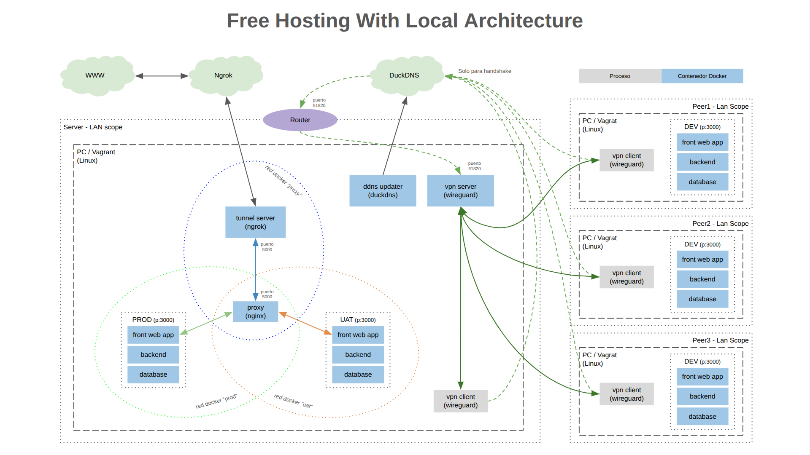

# :globe_with_meridians: Free Hosting With Local Architecture

El proyecto tiene como objetivo facilitar un entorno para hosting y desarrollo de aplicaciones web utilizando herramientas gratuitas. Utiliza contenedores **Docker** para los servicios que componen el entorno.

### :mag: Vista General - Indice

- [Arquitectura](#arquitectura)
- [Pre-requisitos](docs/pre-requisitos.md)
- [Instalación](docs/instalacion.md)
- [Desarrollo](docs/desarrollo.md)
---
### Arquitectura

##### Componentes:

- **VPN Server** (*[Wireguard](https://www.wireguard.com/)*)

  Tiene como objetivo crear una red privada para que tanto el servidor host de la arquitectura ("Server" en la imagen) como los peers utilizados para desarrollar sobre la aplicación web se puedan conectar entre sí.

######

- **DDNS Updater** (*[DuckDNS](https://www.duckdns.org/)*)

  Tiene como objetivo otorgar un dominio "estático" al servidor host de la arquitectura para que pueda ser accedido sin importar si su IP es estática o dinámica. Principalmente utilizado para handshake entre los peers y el **_"VPN Server"_**. Utiliza

######

- **Tunnel Server** (*[Ngrok](https://ngrok.com/)*)

  Tiene como objetivo dar un dominio "estatico" para exponer la aplicacion web en internet.

######

- **Proxy** (*[Nginx](https://nginx.org/)*)

  Tiene como objetivo poder disponibilzar mas de un entorno de la aplicacion web (producción y uat en la imagen).

######

- **Server/Nodo (opcional)** (*[Vagrant](https://developer.hashicorp.com/vagrant)*)

  Vagrant es una maquina virtual, este componente del proyecto no es requerido pero si recomendado para aquellos que quieran tener un entorno aislado o para usuarios de Windows, ya que la solucion esta pensada para entornos linux.
---
# [➡︎](docs/pre-requisitos.md)
